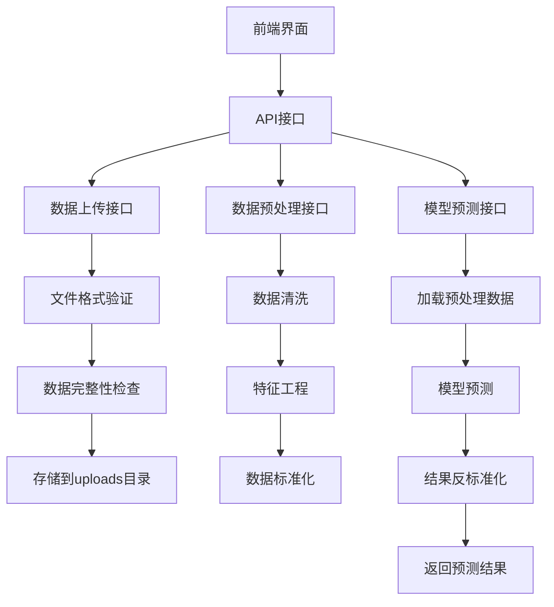

## API接口说明

### 1. 数据上传接口
- 接收CSV文件
- 验证文件格式
- 检查数据完整性
- 存储原始数据

### 2. 数据预处理接口
- 数据清洗
  - 缺失值处理
  - 异常值检测
  - 重复数据删除
- 特征工程
  - 时间特征提取
  - 滞后特征创建
  - 滚动统计特征
- 数据标准化

### 3. 模型预测接口
- 加载预处理数据
- 执行模型预测
- 结果反标准化
- 返回预测结果 