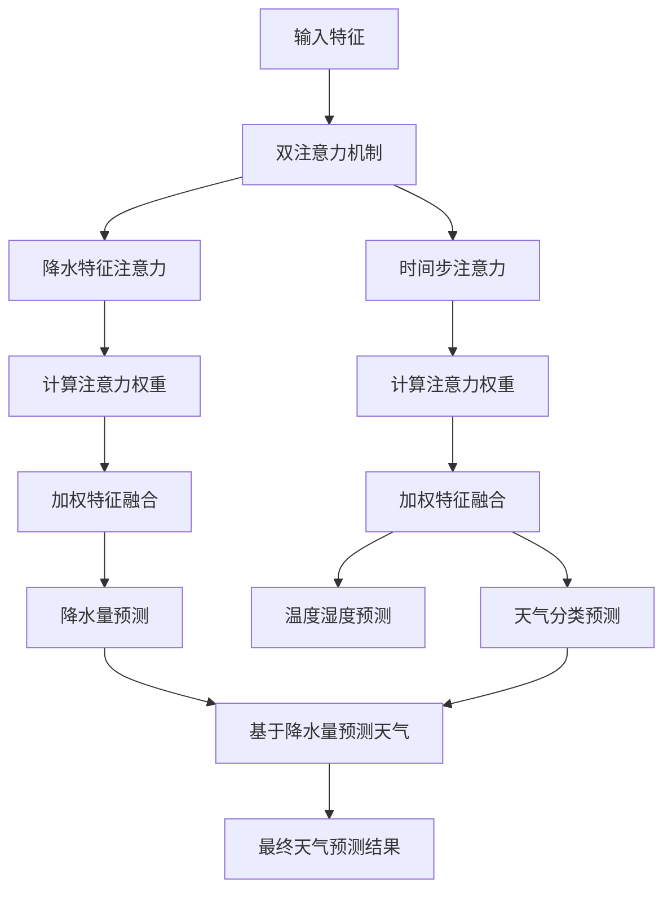

```mermaid
graph TD
    A[输入特征] --> B[双注意力机制]
    
    B --> C1[时间步注意力]
    B --> C2[降水特征注意力]
    
    C1 --> D1[计算注意力权重]
    C2 --> D2[计算注意力权重]
    
    D1 --> E1[加权特征融合]
    D2 --> E2[加权特征融合]
    
    E1 --> F1[天气分类预测]
    E1 --> F2[温度湿度预测]
    E2 --> F3[降水量预测]
    
    F3 --> G[基于降水量预测天气]
    F1 --> G
    G --> H[最终天气预测结果]
```

## 注意力机制说明

### 1. 时间步注意力
- 计算每个时间步的重要性权重
- 突出关键时间步的特征
- 用于天气分类和温湿度预测

### 2. 降水特征注意力
- 专门处理降水相关特征
- 计算降水特征的权重
- 用于降水量预测

### 3. 预测融合
- 基于降水量预测天气类型
- 融合基础天气预测结果
- 生成最终预测 