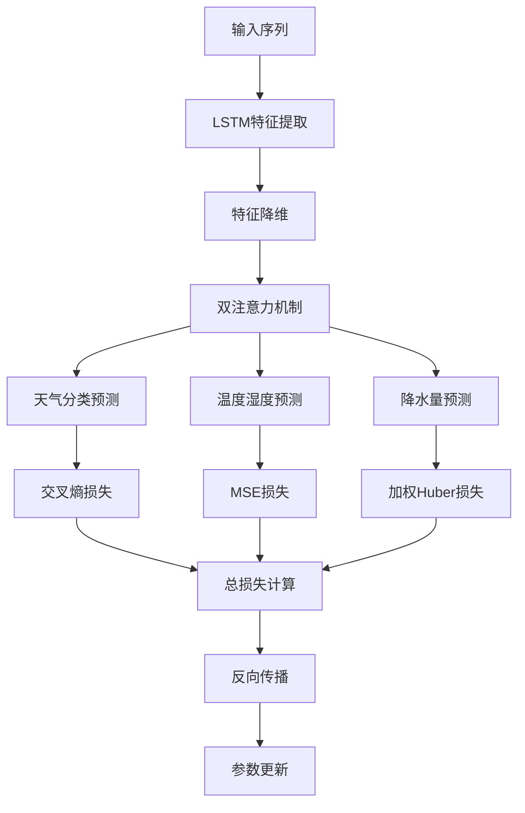

```mermaid
graph TD
    A[输入序列] --> B[LSTM特征提取]
    B --> C[特征降维]
    C --> D[双注意力机制]
    
    D --> E1[天气分类预测]
    D --> E2[温度湿度预测]
    D --> E3[降水量预测]
    
    E1 --> F1[交叉熵损失]
    E2 --> F2[MSE损失]
    E3 --> F3[加权Huber损失]
    
    F1 --> G[总损失计算]
    F2 --> G
    F3 --> G
    
    G --> H[反向传播]
    H --> I[参数更新]
```

## 核心流程说明

### 1. 特征提取
- LSTM层提取时序特征
- 特征降维
- 双注意力机制

### 2. 多任务预测
- 天气分类
- 温度湿度回归
- 降水量预测

### 3. 损失计算
- 交叉熵损失（天气分类）
- MSE损失（温度湿度）
- 加权Huber损失（降水量） 