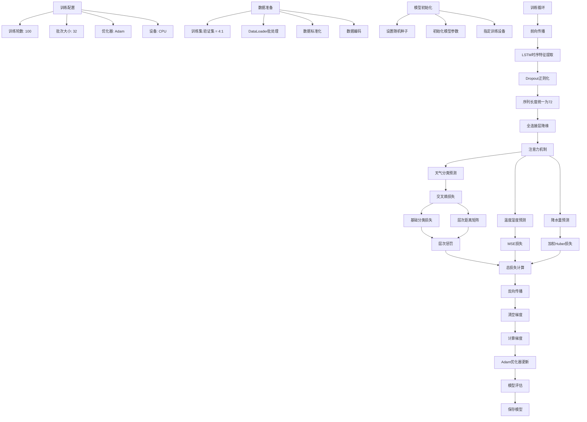

## 损失函数说明

### 1. 天气分类损失
- 基础交叉熵损失
- 层次距离矩阵惩罚
- 总损失 = 基础损失 + 层次惩罚

### 2. 温度湿度预测损失
- MSE损失
- 范围约束
- ReLU惩罚

### 3. 降水量预测损失
- 加权Huber损失
- 有雨样本权重: 3.0
- 无雨样本权重: 1.0

## 模型结构说明

### 1. 特征提取
- LSTM层
- Dropout正则化
- 序列长度: 72时间步

### 2. 预测分支
- 天气分类器
- 温度湿度回归器
- 降水量回归器

### 3. 注意力机制
- 时间步注意力
- 降水量特征注意力 