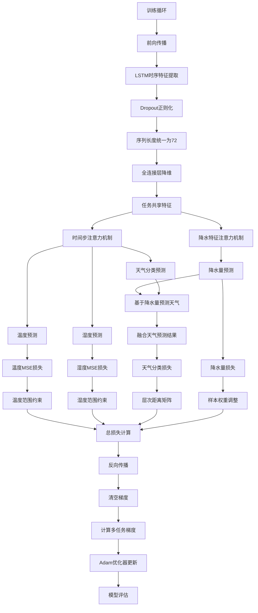

## 训练循环说明

### 1. 前向传播
- LSTM特征提取
- Dropout正则化
- 序列长度统一化
- 特征降维
- 双注意力机制

### 2. 预测分支
- 天气分类预测
- 温度预测
- 湿度预测
- 降水量预测
- 预测结果融合

### 3. 损失计算
- 温度MSE损失 + 范围约束
- 湿度MSE损失 + 双ReLU约束
- 天气分类损失 + 层次矩阵
- 降水量加权Huber损失

### 4. 反向传播
- 梯度清零
- 多任务梯度计算
- Adam参数更新 