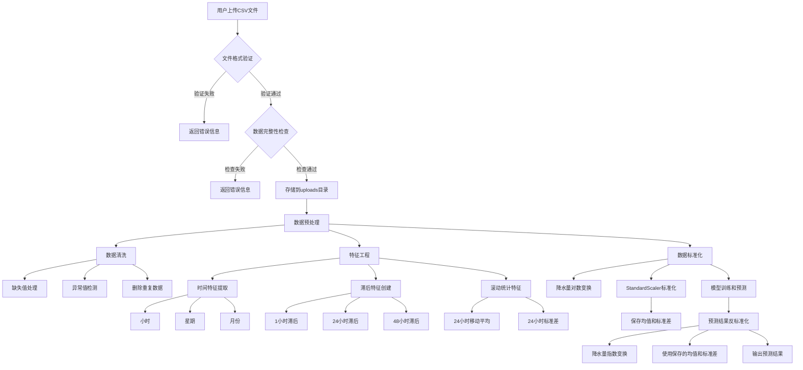

## 数据说明

### 输入数据特征
- 时间
- 温度（摄氏度）
- 相对湿度（%）
- 降水量（mm）
- 气压（hPa）
- 云量（%）
- 风速（m/s）
- 天气代码（WMO标准）

### WMO天气代码
- 0: 晴天
- 1: 多云
- 2: 阴天
- 3: 阴天多云
- 51: 轻度毛毛雨
- 53: 中度毛毛雨
- 55: 重度毛毛雨
- 61: 小雨
- 63: 中雨
- 65: 大雨 